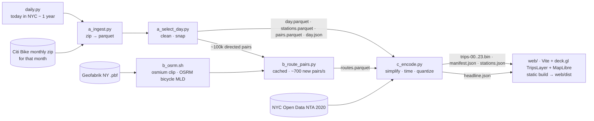

# Circulation

**A trip explorer for Citi Bike in New York on this day one year ago. Pick a place or a station and see where its riders go, or where they come from.**

The day on show is today's date in New York, one year back (29 February shows 28 February). A GitHub Action rebuilds the data and redeploys the site every night, so tomorrow it moves on by a day. Citi Bike publishes its trips a month at a time after the month ends, so a year back is always available. On 2025-09-28, the first day built this way, 161,137 cleaned trips were taken. Each trip is drawn as a glowing trail along an estimated street route. E-bikes are cyan and classic bikes are ember; casual riders are drawn dimmer than members. Above the trails sits the **tide**: every station glows rose while it fills with bikes and violet while it empties.


▶ **[15-second capture](docs/circulation-15s.webm)** (webm, 2 MB). It shows the page load on rides leaving Central Park, a switch to rides arriving there, and a click on the Penn Station dock. · [Phone, 390 px](docs/mobile.jpg)

The page opens on **the rides leaving Central Park**. The bar at the top left is the filter. Its picker chooses **All of New York City**, a named place (Central Park, Penn Station, Brooklyn Bridge Park and others), or the station you last clicked on the map. Its **Leaving / Arriving** toggle shows the count for each direction. **Details** opens the panel with rides by hour and the busiest docks at the other end. The direction carries over when you change place or click a station. The address bar follows the filter, so any view can be shared. Each place is the set of docks that serve it; see `web/src/stations/places.ts`.

The page shows its poster frame (the default filter at 07:30) at the first paint, about 0.1 s in, and is playing by about 1.5 s. It runs at 60 fps across the full 24 hours. Drag the timeline to scrub.

---

## Pipeline



- **The day**: `daily.py` runs every step for one date: today in America/New_York minus one calendar year, or `--date YYYY-MM-DD`. `a_ingest.py` finds that month's file in the S3 bucket listing (monthly zips from 2024 on, yearly bundles before). The monthly files are split by *end* time, so on the last day of a month the next month's file is read too. Trips are counted by `started_at`.
- **Cleaning** drops trips under 60 s or over 3 h, trips with a null station, and round trips. The counts for each rule land in `pipeline/out/day.json`. On 2025-09-28 that took 166,156 raw trips down to **161,137**. Coordinates are snapped to each station's median lat/lng for the month.
- **Routing** uses OSRM v6 with the bicycle profile, on the NY extract clipped to the five boroughs with osmium. Responses are cached in `pipeline/out/routes_cache.duckdb`, keyed by station ids and coordinates, so most pairs on a new day are already routed. On 2025-09-28, 52,374 of 104,038 pairs were new; they took 112 s on an M1, and 19 needed a straight-line fallback. A fully cached re-run of the whole pipeline takes about 35 s.
- **Headline**: `c_encode.py` picks the neighbourhood with the most lopsided hour of arrivals versus departures. On quiet days (holidays, winter) it relaxes its volume thresholds in tiers, and falls back to the busiest hour if nothing qualifies.

## Every night

`.github/workflows/daily.yml` runs at 05:17 UTC, which is 01:17 in New York in summer and 00:17 in winter. Either way it's already the new day in New York.

1. **build**: `.github/scripts/target-day.py` picks the date. The job restores its caches: the OSRM graph (rebuilt monthly), the route cache, the month's trip parquet and the NTA areas. It then runs `b_osrm.sh` and `daily.py --date …`, and checks that `manifest.json` has that date. Next it regenerates the poster with headless Chromium (SwiftShader WebGL). If the poster fails, the build ships without one rather than show another day's. Last, `npm run build`.
2. **deploy** publishes `web/dist` to GitHub Pages. If any step fails, nothing is deployed and the previous day stays live.
3. **record** commits `history/YYYY-MM-DD.json`, a copy of `day.json` plus the deploy time. It keeps a log of every day shown. It also counts as repository activity, and GitHub pauses scheduled workflows after 60 days without any.

**One-time setup**: push to a GitHub repo with `main` as its default branch. Scheduled runs only fire on the default branch, and only `main` deploys. The repo must be public for Pages on a free plan. Then set Settings → Pages → Source to **GitHub Actions**. Data URLs carry `?v=<manifest.generated_at>`, so a browser holding yesterday's cached files never mixes them with today's.

Run it by hand from the Actions tab (**Run workflow**, optional `date`) to rebuild a specific day. Pushes to `main` that touch `web/`, `pipeline/` or the workflow also rebuild and redeploy. A cold run with no caches takes about 20–30 min; a warm one about 10.

The generated data (`web/public/data/`, `pipeline/out/`) is no longer committed. Locally, run `daily.py` once, or the dev server falls back to the synthetic fixture.

The page says **One year ago today** only when the date on show is today's date one year back in New York. If the date is one day behind, which happens between midnight and the nightly deploy, it says **One year ago yesterday**. Otherwise it shows just the date (`web/src/ui/day.ts`).

## Encoding

Each hour gets one binary chunk, `trips-HH.bin`, holding the trips that start in that hour. It is little-endian and every section stays aligned, so the browser decodes it with typed-array views and no parsing:

```
u32 tripCount · u32 vertexCount · u32[tripCount+1] startIndices
u16[vertexCount×2] lng,lat   quantized to manifest.bbox over 0..65535 (≈0.34 m × 0.39 m)
u16[vertexCount]   seconds since HH:00 (real started_at → ended_at, spread by cumulative distance)
u8[tripCount]      flags: bit0 e-bike, bit1 member
```

- **Simplification**: each OSRM route is Douglas–Peucker simplified at **5 m**. That cuts **~121 raw route points per trip** (trip-weighted mean, median 93) down to **12.0 vertices per trip**, or 2,406,916 in total. The round-trip test (`test_encoding.py`, 1,000 random trips) found a worst error of 0.29 m and 0.5 s, against limits of 2 m and 1 s.
- **Decoding**: the client re-sorts each chunk into about 11 render groups per hour by duration class and start window. Only the groups that overlap the clock are drawn. Decoding all 24 chunks takes about 56 ms in total.
- **Tide**: `stations.json` gives each station its net arrivals minus departures in 96 15-minute bins. The client smooths this with a [1 2 1] kernel, clamps at p99 and applies a square root. The colours come from an OKLCH diverging ramp.

### Budget

The sizes and counts in this section, and the numbers under Performance, were measured on 2026-06-03, the fixed day before the nightly build. It had 200,603 trips, which is busier than most days the site will show; 2025-09-28 encodes to 12.6 MB. If a day goes over budget, `c_encode.py` raises the simplification tolerance (up to 20 m) and then subsamples casual riders (down to 20%), and records what it used in `manifest.encoded`.

| | actual (2026-06-03) | budget |
|---|---|---|
| All 24 chunks (uncompressed) | **15.44 MB** (9.5 MB gzip -9) | ≤ 25 MB |
| First 3 chunks (07–09, the opening hours) + manifest | **2.79 MB** | ≤ 5 MB |
| Worst 3 consecutive hours + manifest | 4.38 MB | ≤ 5 MB |
| Peak chunk `trips-17.bin` | 1.62 MB, 20,248 trips | |

**The 5 m simplification alone met the budget. No casual riders were subsampled** (`casual_sample: 1.0` in `manifest.encoded` and `pipeline/out/encode_report.json`).

## Performance

All numbers were measured on an M1 MacBook in Chromium with ANGLE/Metal, against the production build on real data (`npm run build`, then the scripts below). The before/after rows were measured on the first cut of this piece (2025-09-11, 195,875 trips). The bullets below were re-measured on 2026-06-03.

| | before | after |
|---|---|---|
| Vertices per trip | ~121 raw OSRM points | **12.0** (5 m Douglas–Peucker) |
| Trail rendering: stock `TripsLayer` → `CulledTripsLayer`, which drops segments outside [t − trail, t] in the vertex shader. Stress fixture, 140k trips (D) | 35 fps | **60 fps** |
| The same, real data, full 24 h at 720×, 1440×900 @2x | avg 58.5 fps, worst hour 42.8 (18:00) | **60.0 fps every hour** |
| The same, real data, 2560×1440 @2x (5120×2880 px) | avg 47.2 fps, worst hour 25.5 (18:00) | **avg 60.0, worst hour 58.6–59.4** ¹ |
| Playing after load (`npm run verify -- --preview`, 3 cold runs) | 2.2–3.4 s, before the data preloads and the reveal deadline | **1.53 s median** in-page mark (1.52 / 1.53 / 1.53); 1.54 s as Playwright sees it |

¹ One of three culled runs at this size dipped to 47 fps in the 17:00 hour. The glow pass made no measurable difference to it.

- **First paint, about 0.1–0.2 s** (first-contentful-paint 108–188 ms across runs). The poster frame and the date are inlined into `index.html` at build time: a 40×25 blurred placeholder, then `poster.webp` (142 KB), then the date from `manifest.json`. `stations.json` is preloaded too, and the reveal waits for it, so the live map opens on the same filtered view the poster shows.
- **Playing by about 1.5 s.** `index.html` preloads the manifest and the two chunks the opening frame needs, in parallel with the JS bundle. The first chunk is decoded by about 0.2 s. Three cold runs of `npm run verify -- --preview` started playing at 1.52, 1.54 and 1.54 s. Playback starts once those trips are decoded and the basemap is idle, and never later than 1.5 s after navigation. Tiles that arrive after that fill in under the poster's cross-fade. - **Frame rate, full day at 720×** (`node scripts/fps-day.mjs`): **min 60.0 / avg 60.0 fps** at 1440×900 @2x, and avg 60.0 (worst hour 59.8) at 390×844 @3x. deck.gl CPU time is 2.3–3.2 ms per frame.
- **Bundle**: 473 KB of JS gzipped (MapLibre about 300 KB, deck.gl about 160 KB, plus a separate MapLibre worker) and 15 KB of CSS.

**Look.** Trails are blended additively. At rush hour, trail opacity eases down with how busy the city is, read from the manifest histogram (`PEAK_DIM`), so Midtown's avenues glow without washing out to flat white. A faint 4.5 px glow pass under the trails fades out harder at peaks, so bridges and quiet streets glow at night.

**Phones** (`(max-width: 640px), (pointer: coarse)`): **half the trails are drawn**. Every trip is still decoded, so station counts and the tide stay exact. Within each render group, only the trips with an even index in the file are drawn. The decoder sorts those trips first, so each group's draw range is a contiguous prefix with no copies. Phones also skip the glow pass. The filter bar wraps to two rows at the top. The playback controls sit in the bottom 150 px: a one-button speed cycle and an About button. The details panel starts closed on phones and open on desktop. About and the details share one slot: the top-right on desktop, and a bottom sheet above the timeline on phones. Opening About hides the details but leaves the filter as it is.

## Findings

Each day's headline sits in `manifest.headline`, with the rule and the candidate table behind it in `pipeline/out/headline.json`. On 2025-09-28 it reads: *From 7:30 to 8:30pm, Bed-Stuy absorbs 1.6× more bikes than it sends out.*

### Where each number comes from

| number | script → output |
|---|---|
| The date, raw / clean trips, drop counts, stations, source months | `pipeline/a_select_day.py` → `pipeline/out/day.json` (and `history/YYYY-MM-DD.json` for each deployed day) |
| Routing coverage and fallbacks | `pipeline/b_route_pairs.py` → `pipeline/out/routes.parquet`, `route_fallbacks.csv` |
| Headline and runner-ups | `pipeline/c_encode.py` → `pipeline/out/headline.json`, `manifest.headline` |
| Sizes, vertices, simplification, subsampling | `pipeline/c_encode.py` → `pipeline/out/encode_report.json`; checked by `pipeline/test_encoding.py` |

## Reproduce

Requirements: Python 3.12 with [uv](https://docs.astral.sh/uv/), Docker and osmium-tool (routing only), and Node 20 or later.

```bash
cd pipeline
./b_osrm.sh                          # download + clip NY, build OSRM bicycle (MLD), serve on :5055
uv run python daily.py               # today in NYC − 1 year: ingest → select → route → encode → test
uv run python daily.py --date 2025-12-25   # any day Citi Bike has published

# or step by step, as daily.py runs them:
uv run python a_ingest.py --date 2025-09-28     # month zip(s) → data/trips/YYYY-MM.parquet
uv run python a_select_day.py --date 2025-09-28 # → out/day.json, day/stations/pairs.parquet
uv run python b_route_pairs.py                  # → out/routes.parquet (cached, resumable)
uv run python c_encode.py --date 2025-09-28     # → web/public/data/{manifest.json, trips-HH.bin, stations.json}
uv run python test_encoding.py --date 2025-09-28
uv run python b_plot_sample.py       # optional: out/route_samples.png (sanity check)
uv run python make_fixture.py        # optional: synthetic dev data in web/public/fixture/

cd ../web
npm install
npm run dev                          # http://localhost:5173 (uses data/, falls back to fixture/)
npm run build && npm run preview     # static site in web/dist
npm run poster                       # regenerate the poster frame from the live app (CIRC_GL=swiftshader|metal)
npm run verify -- --preview          # poster at first frame, timings, fps, console errors
node scripts/fps-day.mjs             # fps across a whole simulated day
node scripts/shots.mjs --preview [--mobile]   # review screenshots
node scripts/record.mjs              # docs/circulation-15s.webm
```

URL parameters: `?t=HH:MM`, `?speed=`, `?paused`, `?debug` (fps meter), `?place=<id>` (open on a place, e.g. `penn-station`; `all` for no filter; default `central-park`), `?station=<id>` (open on a station, by Citi Bike station id), `?dir=in|out` (rides arriving or leaving; default `out`), `?data=fixture` (dev only; the fixture is left out of `dist`), `?density=full|half`, `?halo=0`, and `?nocull` (stock TripsLayer, for comparison). Keyboard: Space plays and pauses, ←/→ jumps 15 min, 1/2/3 sets the speed, Esc closes About, then hides the details.

## Credits

- Trip data: [Citi Bike System Data](https://citibikenyc.com/system-data), from Lyft / NYC Bike Share, used under the Citi Bike Data License Agreement.
- Routing: [OSRM](https://project-osrm.org) on © [OpenStreetMap contributors](https://www.openstreetmap.org/copyright) (ODbL), using the Geofabrik New York extract.
- Basemap: © [CARTO](https://carto.com/attributions) Dark Matter, © OpenStreetMap contributors.
- Areas: [NYC Open Data](https://opendata.cityofnewyork.us). The 2020 Neighborhood Tabulation Areas name the headline's region.
- Chapter weather: [Open-Meteo](https://open-meteo.com) historical archive (ERA5), Central Park.
- Built with deck.gl, MapLibre GL, Vite, DuckDB, shapely and Playwright.

**Estimated routes.** Citi Bike publishes start and end stations and times, not GPS traces. Each trail is the OSRM bicycle shortest path between its two stations, with the trip's real start and end times spread evenly along the path. Stations are placed at their median reported coordinates for the month.
