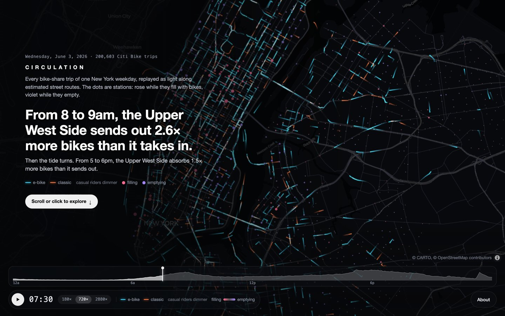
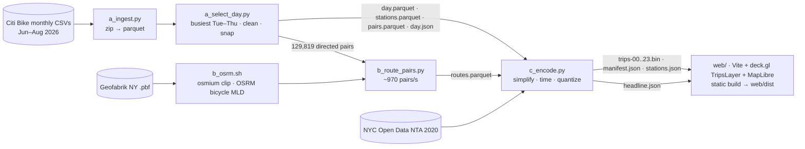

# Circulation

**One real weekday of every Citi Bike trip in New York, replayed as light. Citi Bike is the city's bloodstream.**

> **From 8 to 9am, the Upper West Side sends out 2.6× more bikes than it takes in** (1,116 out, 437 in, across 48 stations). Then the tide turns: from 5 to 6pm, it absorbs 1.5× more than it sends out.

The day is Wednesday 3 June 2026, when 200,603 cleaned trips were taken. Each trip is drawn as a glowing trail along an estimated street route. E-bikes are cyan and classic bikes are ember; casual riders are drawn dimmer than members. Above the trails sits the **tide**: every station glows rose while it fills with bikes and violet while it empties.



▶ **[15-second capture](docs/circulation-15s.webm)** (webm, 4 MB). It shows the page load, the intro over the morning rush, and a click on the Penn Station dock. · [Phone, 390 px](docs/mobile.jpg)

The page shows its poster frame at the first paint, about 0.1 s in, and is playing by about 1.5 s. It runs at 60 fps across the full 24 hours. You can drag the timeline and click any station to see where its riders go.

---

## Pipeline



- **Day selection**: `a_select_day.py` picks the Tuesday, Wednesday or Thursday of June–August 2026 with the most raw trips. August 2026 is the newest month Citi Bike has published. The monthly files are split by *end* time, so all three months are unioned and trips are counted by `started_at`. That gives 2026-06-03 with 204,801 raw trips. The runner-up was 2026-06-18 with 202,997.
- **Cleaning** drops trips under 60 s (0) or over 3 h (178), trips with a null station (499), and round trips (3,521). That leaves **200,603**. Coordinates are snapped to each station's median lat/lng for the month, across 2,251 stations.
- **Routing** uses OSRM v6 natively on arm64 with the bicycle profile. The NY extract is clipped to the five boroughs with osmium. All 129,819 directed pairs have a route: 85,749 were new and routed in 72 s (about 1,190 pairs/s), and the rest came from the OSRM response cache. Only **33 (0.025%)** needed a straight-line fallback: 21 were water-crossing detours and 12 were NJ pairs. The median route is 2.6 km, 1.28× the straight-line distance.

## Encoding

Each hour gets one binary chunk, `trips-HH.bin`, holding the trips that start in that hour. It is little-endian and every section stays aligned, so the browser decodes it with typed-array views and no parsing:

```
u32 tripCount · u32 vertexCount · u32[tripCount+1] startIndices
u16[vertexCount×2] lng,lat   quantized to manifest.bbox over 0..65535 (≈0.34 m × 0.39 m)
u16[vertexCount]   seconds since HH:00 (real started_at → ended_at, spread by cumulative distance)
u8[tripCount]      flags: bit0 e-bike, bit1 member
```

- **Simplification**: each OSRM route is Douglas–Peucker simplified at **5 m**. That cuts **~121 raw route points per trip** (trip-weighted mean, median 93) down to **12.0 vertices per trip**, or 2,406,916 in total. The round-trip test (`test_encoding.py`, 1,000 random trips) found a worst error of 0.29 m and 0.5 s, against limits of 2 m and 1 s.
- **Decoding**: the client re-sorts each chunk into about 11 render groups per hour by duration class and start window. Only the groups that overlap the clock are drawn. Decoding all 24 chunks takes about 56 ms in total.
- **Tide**: `stations.json` gives each station its net arrivals minus departures in 96 15-minute bins. The client smooths this with a [1 2 1] kernel, clamps at p99 and applies a square root. The colours come from an OKLCH diverging ramp.

### Budget

| | actual | budget |
|---|---|---|
| All 24 chunks (uncompressed) | **15.44 MB** (9.5 MB gzip -9) | ≤ 25 MB |
| First 3 chunks (07–09, the opening hours) + manifest | **2.79 MB** | ≤ 5 MB |
| Worst 3 consecutive hours + manifest | 4.38 MB | ≤ 5 MB |
| Peak chunk `trips-17.bin` | 1.62 MB, 20,248 trips | |

**The 5 m simplification alone met the budget. No casual riders were subsampled** (`casual_sample: 1.0` in `manifest.encoded` and `pipeline/out/encode_report.json`).

## Performance

All numbers were measured on an M1 MacBook in Chromium with ANGLE/Metal, against the production build on real data (`npm run build`, then the scripts below). The before/after rows were measured on the first cut of this piece (2025-09-11, 195,875 trips). The bullets below were re-measured on 2026-06-03.

| | before | after |
|---|---|---|
| Vertices per trip | ~121 raw OSRM points | **12.0** (5 m Douglas–Peucker) |
| Trail rendering: stock `TripsLayer` → `CulledTripsLayer`, which drops segments outside [t − trail, t] in the vertex shader. Stress fixture, 140k trips (D) | 35 fps | **60 fps** |
| The same, real data, full 24 h at 720×, 1440×900 @2x | avg 58.5 fps, worst hour 42.8 (18:00) | **60.0 fps every hour** |
| The same, real data, 2560×1440 @2x (5120×2880 px) | avg 47.2 fps, worst hour 25.5 (18:00) | **avg 60.0, worst hour 58.6–59.4** ¹ |
| Playing after load (`npm run verify -- --preview`, 3 cold runs) | 2.2–3.4 s, before the data preloads and the reveal deadline | **1.53 s median** in-page mark (1.52 / 1.53 / 1.53); 1.54 s as Playwright sees it |

¹ One of three culled runs at this size dipped to 47 fps in the 17:00 hour. The glow pass made no measurable difference to it.

- **First paint, about 0.1 s** (first-contentful-paint 108 ms). The poster frame and the intro headline are inlined into `index.html` at build time: a 40×25 blurred placeholder, then `poster.webp` (136 KB), then the headline text from `manifest.json`. So the insight is on screen before any JavaScript runs.
- **Playing by about 1.5 s.** `index.html` preloads the manifest and the two chunks the opening frame needs, in parallel with the JS bundle. The first chunk is decoded by about 0.2 s. Three cold runs of `npm run verify -- --preview` started playing at 1.52, 1.54 and 1.54 s. Playback starts once those trips are decoded and the basemap is idle, and never later than 1.5 s after navigation. Tiles that arrive after that fill in under the poster's cross-fade. - **Frame rate, full day at 720×** (`node scripts/fps-day.mjs`): **min 60.0 / avg 60.0 fps** at 1440×900 @2x, and avg 60.0 (worst hour 59.8) at 390×844 @3x. deck.gl CPU time is 2.3–3.2 ms per frame.
- **Bundle**: 473 KB of JS gzipped (MapLibre about 300 KB, deck.gl about 160 KB, plus a separate MapLibre worker) and 15 KB of CSS.

**Look.** Trails are blended additively. At rush hour, trail opacity eases down with how busy the city is, read from the manifest histogram (`PEAK_DIM`), so Midtown's avenues glow without washing out to flat white. A faint 4.5 px glow pass under the trails fades out harder at peaks, so bridges and quiet streets glow at night.

**Phones** (`(max-width: 640px), (pointer: coarse)`): **half the trails are drawn**. Every trip is still decoded, so station counts and the tide stay exact. Within each render group, only the trips with an even index in the file are drawn. The decoder sorts those trips first, so each group's draw range is a contiguous prefix with no copies. Phones also skip the glow pass, and portrait screens are framed on Midtown. The controls sit in the bottom 150 px: a one-button speed cycle and an About button. The about and station panels share one bottom sheet above the timeline. On desktop they share the top-right slot, and only one is open at a time.

## Findings

**The tide.** In the morning, the Upper West Side empties: 1,116 bikes leave and 437 arrive between 8 and 9am. From 5 to 6pm it runs the other way, taking in 1.5× more than it sends out. The encoder also considered these runner-ups: from 6:30 to 7:30am the East Village sends out 2.8×; from 6:45 to 7:45am Midtown absorbs 2.5×; from 9:15 to 10:15pm Bed-Stuy absorbs 2.1×.

### Where each number comes from

| number | script → output |
|---|---|
| The date, 204,801 raw / 200,603 clean trips, drop counts, 2,251 stations | `pipeline/a_select_day.py` → `pipeline/out/day.json` |
| Routing coverage and fallbacks | `pipeline/b_route_pairs.py` → `pipeline/out/routes.parquet`, `route_fallbacks.csv` |
| Headline (2.6×, 1,116 / 437, 48 stations) and runner-ups | `pipeline/c_encode.py` → `pipeline/out/headline.json` (rule and candidate table), `manifest.headline` |
| Sizes, vertices, simplification, no subsampling | `pipeline/c_encode.py` → `pipeline/out/encode_report.json`; checked by `pipeline/test_encoding.py` |

## Reproduce

Requirements: Python 3.12 with [uv](https://docs.astral.sh/uv/), Docker and osmium-tool (routing only), and Node 20 or later.

```bash
cd pipeline
uv run python a_ingest.py            # Jun–Aug 2026 zips → data/trips/*.parquet
uv run python a_select_day.py        # → out/day.json, day/stations/pairs.parquet
./b_osrm.sh                          # download + clip NY, build OSRM bicycle (MLD), serve on :5055
uv run python b_route_pairs.py       # → out/routes.parquet (cached, resumable)
uv run python b_plot_sample.py       # → out/route_samples.png (sanity check)
uv run python c_encode.py            # → web/public/data/{manifest.json, trips-HH.bin, stations.json}
uv run python test_encoding.py       # round-trip + budget test
uv run python make_fixture.py        # optional: synthetic dev data in web/public/fixture/

cd ../web
npm install
npm run dev                          # http://localhost:5173 (uses data/, falls back to fixture/)
npm run build && npm run preview     # static site in web/dist
npm run poster                       # regenerate the poster frame from the live app
npm run verify -- --preview          # poster at first frame, timings, fps, console errors
node scripts/fps-day.mjs             # fps across a whole simulated day
node scripts/shots.mjs --preview [--mobile]   # review screenshots
node scripts/record.mjs              # docs/circulation-15s.webm
```

URL parameters: `?t=HH:MM`, `?speed=`, `?paused`, `?debug` (fps meter), `?nointro`, `?data=fixture` (dev only; the fixture is left out of `dist`), `?density=full|half`, `?halo=0`, and `?nocull` (stock TripsLayer, for comparison). Keyboard: Space plays and pauses, ←/→ jumps 15 min, 1/2/3 sets the speed, Esc closes panels.

## Credits

- Trip data: [Citi Bike System Data](https://citibikenyc.com/system-data), from Lyft / NYC Bike Share, used under the Citi Bike Data License Agreement.
- Routing: [OSRM](https://project-osrm.org) on © [OpenStreetMap contributors](https://www.openstreetmap.org/copyright) (ODbL), using the Geofabrik New York extract.
- Basemap: © [CARTO](https://carto.com/attributions) Dark Matter, © OpenStreetMap contributors.
- Areas: [NYC Open Data](https://opendata.cityofnewyork.us). The 2020 Neighborhood Tabulation Areas name the headline's region.
- Chapter weather: [Open-Meteo](https://open-meteo.com) historical archive (ERA5), Central Park.
- Built with deck.gl, MapLibre GL, Vite, DuckDB, shapely and Playwright.

**Estimated routes.** Citi Bike publishes start and end stations and times, not GPS traces. Each trail is the OSRM bicycle shortest path between its two stations, with the trip's real start and end times spread evenly along the path. Stations are placed at their median reported coordinates for the month.
